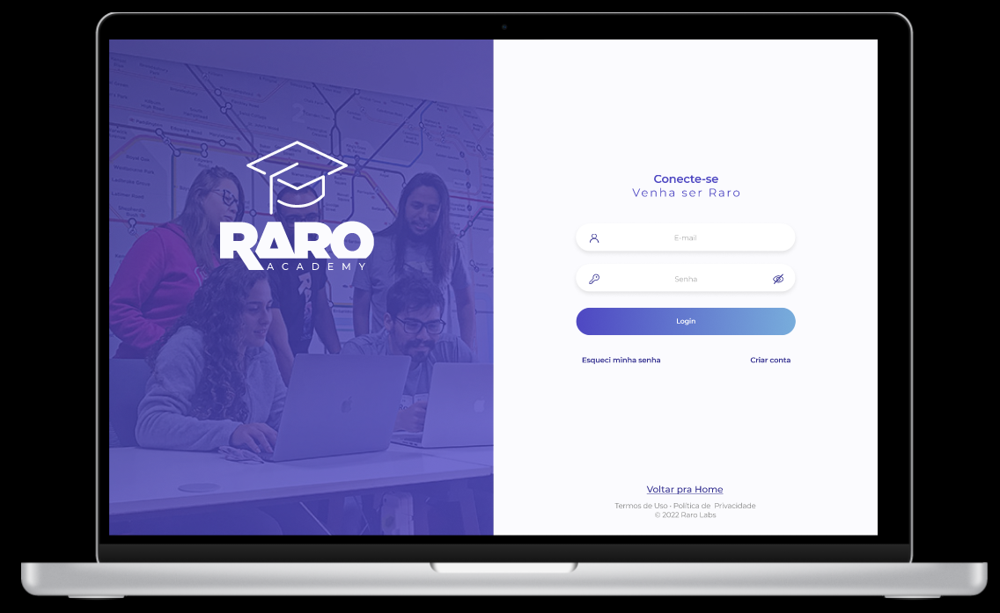

<!-- Topo do Readme -->
<div id="top"></div>
<!--Banner do site Raro Class-->
<h1 align="center">
    
</h1>

<!-- Sumário / Âncora -->
<details>
  <summary>Sumário</summary>
  <ol style='list-style: disc;'>
    <li>
     <a href="#sobre-o-projeto">💻 Sobre o projeto</a>
    </li>
    <li>
      <a href="#layout">🎨 Layout</a>
    </li>
    <li>
      <a href="#linguagens-e-ferramentas">🛠 Linguagens e Ferramentas</a>
    </li>
    </ul>
    <li>
      <a href="#como-executar-o-projeto">📦 Como executar o projeto</a>
    </li>
    <ul>
      <li>
        <a href="#pré-requisitos">Pré-Requisitos</a>
      </li>
      <li>
        <a href="#instalando">Instalando</a>
      </li>
      <li>
        <a href="#inicie-a-aplicação">Inicie a aplicação</a>
      </li>
    </ul>
    <li>
      <a href="#roadmap">🚀 Futuras Features </a>
    </li>
    <li>
      <a href="#desenvolvedores">💻 < Desenvolvedores /> </a>
    </li>
    <li>
      <a href="#agradecimentos">💙 Agradecimentos</a>
    </li>
  </ol>
</details>
<div id="sobre-o-projeto"></div>

___
<!-- Sobre o projeto Raro Class -->

## 💻 Sobre o projeto

A **Raro Class** é uma plataforma digital onde ficam disponibilizadas as **aulas gravadas** pela **Raro Academy**, de forma **online** e com um ambiente agradável para o aluno.

O **aluno matriculado** na Raro Academy pode assistir a estas aulas gravadas quando e onde quiser!
- O **aluno** pode se cadastrar na Raro Class com:
  - seu e-mail
  - senha
  - e o **código da turma** - que irá receber após a sua matrícula na Raro Academy.

- O **aluno autenticado** na Raro Class poderá:
  - assistir as aulas gravadas (aulas do curso, monitoria e aula pública/aulão da Raro)
  - filtrá-las por semana
  - favoritá-las
  - e fazer comentários na vídeo aula

Também há a possibilidade dos **visitantes** do site Raro Class **assistirem às aulas** de forma **online** e terem aquele gostinho de experienciar uma aula com a Raro Academy!

Estas aulas são chamadas de **aulas públicas**, disponibilizadas pela Raro Academy na página inicial - aulas apelidadas carinhosamente de **“Aulão da Raro”.**

<p align="right"><a href="#top">▲ Topo do site</a></p>
<div id="layout"></div>

___
<!-- Layout -->

# 🎨 Layout

O layout da aplicação está disponível no Figma:

<a href="https://www.figma.com/proto/oa5yvAXVhSfdAtCkrn7MsK/Design-RaroClass?node-id=382%3A2839&scaling=scale-down&page-id=0%3A1" target="_blank" rel="noreferrer">
  
</a>


### Website

<p align="center" style="display: flex; align-items: flex-start; justify-content: center;">
  

  <!---->
</p>


<p align="right"><a href="#top">▲ Topo do site</a></p>
<div id="linguagens-e-ferramentas"></div>

___
<!-- Linguagens e ferramentas -->

## 🛠 Linguagens e ferramentas

- [React JS](https://reactjs.org/)
- [TypeScript](https://www.typescriptlang.org/)
- [Git](https://git-scm.com/) e  [GitHub](https://github.com/)
- [HTML 5](https://www.w3schools.com/html/)
- [CSS 3](https://www.w3schools.com/css/)
- [Figma](https://www.figma.com/)

<p align="right"><a href="#top">▲ Topo do site</a></p>
<div id="como-executar-o-projeto"></div>

___
<!-- Como executar o projeto -->

## 📦 Como executar o projeto

### Pré-requisitos
Antes de começar, você precisa ter instalado:
- [Node.js](https://nodejs.org/en/)
- [VsCode](https://code.visualstudio.com/) ou um editor de sua preferência.

### Instalando
```bash
# Clone este repositório
$ git clone https://github.com/rarolabs/raro-academy-react-grupo-5

# Acesse a pasta pelo terminal
$ cd raro-academy-react-grupo-5

# Instale as dependências
$ npm install
```

### Inicie a aplicação
```bash
$ npm start

# A aplicação será aberta no link http://localhost:3000
```
<p align="right"><a href="#top">▲ Topo do site</a></p>
<div id="roadmap"></div>

___
<!-- Roadmap/Melhorias -->

## 🚀 Futuras Features
- Site em geral:
  - [ ] responsividade Web em todo o site;
  - [ ] responsividade Mobile;
  - [ ] receber outros cursos na plataforma;
  - [ ] links ancorados na página inicial levando e alinhando aos aulões do curso escolhido;

- Aluno:
  - Página inicial:
      - [ ] filtro por data nas aulas do curso;
      - [ ] filtro nas aulas de monitoria;
      - [ ] mostrar indicador da quantidade de vídeos na navegação horizontal;
  - Dropdown do avatar:
      - [ ] gerenciar perfil (nome, foto e senha);
      - [ ] acesso ao cronograma da aula;
      - [ ] trocar de área de curso, se matriculado;
  - Página de visualização:
      - [ ] poder editar e excluir o comentário;   
      
<br/>
Acompanhe a lista das [issues abertas](https://github.com/rarolabs/raro-academy-react-grupo-5/issues).

<p align="right"><a href="#top">▲ Topo do site</a></p>
<div id="desenvolvedores"></div>

___
<!-- Desenvolvedores -->

## 💻 < Desenvolvedores />

**Projeto desenvolvido** com carinho no final do **Curso de React JS_2022**, pelo grupo  "Na minha máquina funciona", composto **pelos alunos:**

<br/>
<table align="center" border-style="none" class="markdown-body">
  <tr>
    <td align="center"><a href="https://github.com/Denis-araujo"><br /><sub><b>Denis Gomes</b></sub></a></td>
    <td align="center"><a href="https://github.com/Evanildo-Silva"><br /><sub><b>Evanildo Silva</b></sub></a></td>
    <td align="center"><a href="https://github.com/franzitaz"><br /><sub><b>Francielle Zucolota</b></sub></a></td>
    <td align="center"><a href="https://github.com/lcastrof"><br /><sub><b>Lucas Castro</b></sub></a></td>
  </tr>
</table>

<p align="right"><a href="#top">▲ Topo do site</a></p>
<div id="agradecimentos"></div>

___
<!-- Agradecimentos -->

## 💙 Agradecimentos

Agradecemos a [Raro Labs](https://rarolabs.com.br/) pela iniciativa da [Raro Academy](https://www.raroacademy.com.br/).

O nosso muito obrigado a toda [Raro Academy](https://www.raroacademy.com.br/) por todo o suporte, atenção e momentos de discontração nestas 10 semanas sobre o curso React JS no ano de 2022.

Agradecimentos especiais a todos os professores, monitores, envolvidos e colegas de classe.

Somos gratos a toda experiência com a Raro Academy e finalizamos este curso com mais consciência para continuar melhorando como profissionais e como pessoas.

Obrigado por todo o conhecimento compartilhado!

<p align="right"><a href="#top">▲ Topo do site</a></p>
